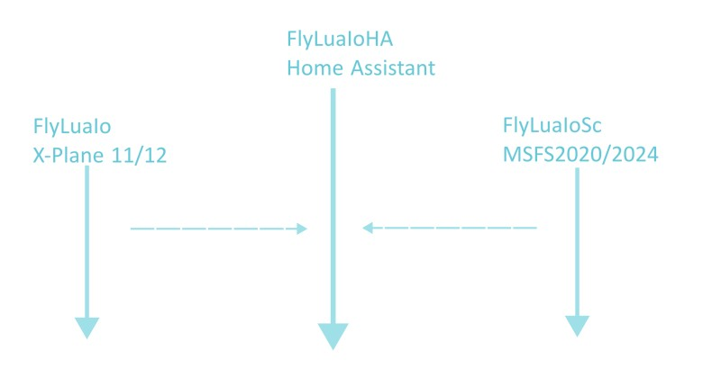

[](https://github.com/FlyLuaIo/flyluaioha/actions/workflows/validate.yaml)


## FlyLuaIoHA (HACS Custom Integration) — Using Events

FlyLuaIoHA exposes Home Assistant events from FlyLuaIo, it requires:

* [FlyLuaIo](https://gitee.com/FlyLuaIo/flyluaio/releases) for X-Plane 11/12
* [FlyLuaIoSc](https://gitee.com/FlyLuaIo/flyluaiosc/releases/) for MSFS 2020/2024

Instead of directly controlling devices, you create automations that react to these events. This keeps logic in Home Assistant, making it flexible and extensible.



## Video Demo(how to install)

https://youtu.be/5mgTzvETtQw

## Installation

### Via HACS (Recommended): [HACS](https://hacs.xyz/)

One-click installation from HACS:

[](https://my.home-assistant.io/redirect/hacs_repository/?owner=FlyLuaIo&repository=flyluaioha&category=integration)

Or, HACS > In the search box, type **FlyLuaIo HA** > Click **FlyLuaIo HA**, getting into the detail page > DOWNLOAD


### Manual Installation

1. Copy the `custom_components/flyluaioha` folder to your `custom_components` directory
2. Restart Home Assistant

### Developer Installation: Git clone from GitHub

```bash
cd config
git clone https://github.com/FlyLuaIo/flyluaioha.git
cd flyluaioha
./install.sh /config
```

It is convenient to switch to a tag when updating `FlyLuaIoHA` to a certain version.

For example, update to version v1.0.0

```bash
cd config/flyluaioha
git fetch
git checkout v1.0.0
./install.sh /config
```

## Configuration


you need the IP address of where X-Plane FlyLuaIo Addon or MSFS FlyLuaIoSc is running

## Events (Home Assistant events)

- flyluaioha_key_event
  - qid: FlyLuaIo device id (number)
  - key: key code (number, e.g., 0x13 = 19)
  - isrelease: whether the key is released (true/false)
  - timestamp: event timestamp (float)

- flyluaioha_pack_event
  - onoff: power state (true/false)
  - timestamp: event timestamp (float)

### Example: Control a light on key event

```yaml
alias: FlyLuaIoHA DOME BRT
description: ""
triggers:
  - event_type: flyluaioha_key_event
    event_data:
      qid: 9
      key: 18
    trigger: event
conditions: []
actions:
  - if:
      - condition: template
        value_template: "{{ trigger.event.data.isrelease }}"
    then:
      - action: switch.turn_off
        target:
          entity_id: switch.zimi_cn_1021898767_dhkg01_on_p_2_1
        data: {}
    else:
      - action: switch.turn_on
        metadata: {}
        data: {}
        target:
          entity_id: switch.zimi_cn_1021898767_dhkg01_on_p_2_1
```

```yaml
alias: FlyLuaIoHA DOME DIM
description: ""
triggers:
  - event_type: flyluaioha_key_event
    event_data:
      qid: 9
      key: 19
    trigger: event
conditions: []
actions:
  - if:
      - condition: template
        value_template: "{{ trigger.event.data.isrelease }}"
    then:
      - action: switch.turn_on
        metadata: {}
        data: {}
        target:
          entity_id: switch.giot_cn_1163257474_v8icm_on_p_2_1
    else:
      - action: switch.turn_off
        target:
          entity_id: switch.giot_cn_1163257474_v8icm_on_p_2_1
        data: {}

```

### Example: AC mode from aircraft Pack event

```yaml
# configuration.yaml
alias: FlyLuaIoHA pack controls AC
description: ""
triggers:
  - event_type: flyluaioha_pack_event
    trigger: event
conditions: []
actions:
  - if:
      - condition: template
        value_template: "{{ trigger.event.data.onoff }}"
    then:s
      - sequence:
          - service: climate.set_temperature
            data:
              temperature: |
                {{ trigger.event.data.degree | float }}
              hvac_mode: auto
            target:
              entity_id: climate.210006721135374_climate
    else:
      - sequence:
          - service: climate.set_hvac_mode
            entity_id: climate.210006721135374_climate
            data:
              hvac_mode: off

```

